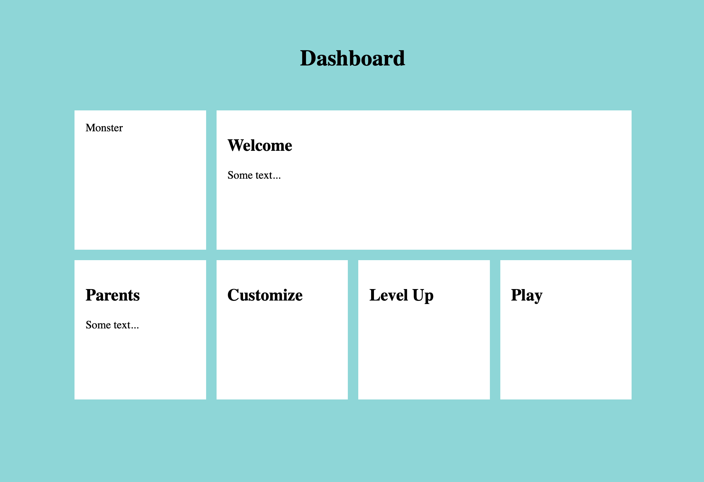

# FEW 2.2 Lab 2

Consider this exercise as a practice interview question. There are two parts: an on site question and a take home question. The take home question is at the bottom of this page [here](https://github.com/Tech-at-DU/ACS-3320-Web-Design-and-Advanced-CSS/blob/master/lessons/lesson-06.md#after-class).

Imagine you need to design a dashboard page for a new product. This page is divided into a grid. Below is an image showing what the final page might look like.

Grid Challenge:



Your goal is to recreate the image above with the markup below. Imagine this as a coding interview.

Follow these steps:

- Think about the problem and formulate at least one question for the interviewer. Your question should help clarify the problem and focus the expectation.
- Outline your solution with comments. Think of this as Pseudo coding your solution! Review your pseudo code with the interviewer before coding!
- Code your solution.

```HTML
<!DOCTYPE html>
<html>

<head>
  <meta charset="UTF-8">
  <meta name="viewport" content="width=device-width, initial-scale=1.0">
  <title>Dashboard</title>
  <style>
    /* Styles go here */
  </style>
</head>

<body>
  <div class="dashboard">
    <h1 class="title">Dashboard</h1>
    <div class="monster grid-cell">Monster</div>
    <div class="welcome grid-cell">
      <h2>Welcome</h2>
      <p>Some text... </p>
    </div>
    <div class="parents grid-cell">
      <h2>Parents</h2>
      <p>Some text... </p>
    </div>
    <div class="customize grid-cell">
      <h2>Customize</h2>
    </div>
    <div class="level-up grid-cell">
      <h2>Level Up</h2>
    </div>
    <div class="play grid-cell">
      <h2>Play</h2>
    </div>
  </div>
</body>

</html>
```
